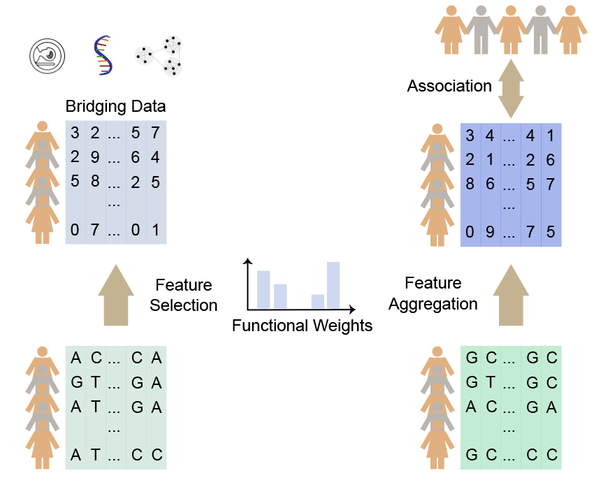

## Users’ Manual of IMAS
### IMAS: A statistical method for image-mediated association studies discovers genes and pathways associated with four brain disorders
Brain imaging and genomic sequencing are critical tools enabling characterization of genetic basis of brain disorders. However, imaging large cohorts is expensive, and may be unavailable for legacy datasets used for genome-wide association study (GWAS). Using an integrated feature selection/aggregation model, we developed Image-Mediated Association Study (IMAS), which utilizes borrowed imaging/genomics data to conduct association mapping in legacy GWAS cohorts. By leveraging the UK Biobank image-derived phenotypes (IDPs), IMAS discovered genetic bases underlying four neuropsychiatry disorders and verified them by analyzing annotations, pathways and eQTLs. A cerebellar abnormality-mediated mechanism was identified to be common to the four disorders. Simulations show that, if the goal is genetic basis, IMAS is more powerful than a hypothetical protocol in which the imaging were available in the GWAS dataset. This implies the feasibility of reanalyzing legacy GWAS datasets without conducting additional imaging, yielding cost-savings for integrated analysis of genetics and imaging. 

### Installation
IMAS is a batteries-included JAR executable. All needed external jar packages are included in the downloadable, IMAS.jar. To download all necessary files, users can use the command 
`git clone https://github.com/theLongLab/IMAS.git`

As we used an R package "SKAT", the users have to install "R" and "SKAT" (https://cran.r-project.org/web/packages/SKAT/index.html). The versions of "R" and "SKAT" package that we have used on our platform are: version 2.0.0 for "SKAT" and version 3.5.1 for "R". Users are also expected to have java (version: 1.8) and Plink (version: 1.9) should also be installed on their platform.

Usage:

The IMAS model includes two steps. First, IMAS selects genetic variants (and their weights) using the IDP cohort that contains genotype and the image features. Second, IMAS aggregates the selected (weighted) variants to associate them to the disease phenotype. For each step, IMAS provides two alternative methods (1.a) Elastic Net, (1.b) Linear Mixed Model, and (2.a) Linear Combination, (2.b) Weighted Kernel, potentially four configurations. However, the recommended default protocol is (1.b) + (2.b), i.e., linear mixed model plus kernel method.

The IMAS provided five different functions, including:
1) LMM-Kernel: (1.b) + (2.b)
2) EN-Kernel: (1.a) + (2.b)
3) LMM-Linear: (1.b) + (2.a)
4) EN-Linear: (1.a) + (2.a)
5) IMAS: The weights can come from any feature selection methods, including but not limited to (1.a) and (1.b),and "IMAS" function provides results for both (2.a) and (2.b)

Running the command:

`java -jar IMAS.jar LMM-Kernel|EN-Kernel|LMM-Linear|EN-Linear|IMAS -format csv|plink -input_genotype INPUT_GENOTYPE_FILE -input_phenotype INPUT_PHENOTYPE_FILE -input_phenotype_column INPUT_PHENOTYPE_COLUMN_START:2|6 -input_phenotype_type PHENOTYPE_TYPE: continuous|binary -snp_info_path WEIGHT_FILE  -pheno_id INPUT_IDP_ID  -plink PLINK_BINARY_FILE_PATH  -Rscript RSCRIPT_BINARY_FILE_PATH -output_folder OUTPUT_FOLDER_PATH -cmd_folder /PATH/TO/IMAS_Association.R`

A simple example are described below. Users can get the final p-value result under the folder: OUTPUT_FOLDER_PATH. Take the function "LMM-Kernel" and IDP "25904-2.0" as an example:

1. If trying csv format, the command line is:

`java -jar ./CODE/IMAS.jar LMM-Kernel -format csv -input_genotype ./EXAMPLE/CSV_FORMAT/example.csv -input_phenotype ./EXAMPLE/CSV_FORMAT/example.tsv -input_phenotype_column 2 -input_phenotype_type binary -snp_info_path ./WEIGHT/IMAS_LMM_WEIGHT_p0.01.txt -pheno_id 25904-2.0 -plink /PATH/TO/plink -Rscript /PATH/TO/Rscript -output_folder /PATH/TO/OUT_FOLDER -cmd_folder ./CODE/`

2. If users want to try plink format, the command line is:

`java -jar ./CODE/IMAS.jar LMM-Kernel -format plink -input_genotype ./EXAMPLE/PLINK_FORMAT/example.tped -input_phenotype ./EXAMPLE/PLINK_FORMAT/example.tfam -input_phenotype_column 6 -input_phenotype_type binary -snp_info_path ./WEIGHT/IMAS_LMM_WEIGHT_p0.01.txt -pheno_id 25904-2.0 -plink /PATH/TO/plink -Rscript /PATH/TO/Rscript -output_folder /PATH/TO/OUT_FOLDER -cmd_folder ./CODE/`

Please note that, to consistent with plink format, the phenotype is set to missing (normally represented by -9) if unspecified. It must be a numeric value. Case/control phenotypes are normally coded as control = 1, case = 2.The IMAS.result under /PATH/TO/OUT_FOLDER is the final output file by IMAS.

### Contacts
  Jingni He: jingni.he1@ucalgary.ca 
  Quan Long: quan.long@ucalgary.ca 
  Paul Arnold: paul.arnold@ucalgary.ca 

### Copyright License (MIT Open Source)
Permission is hereby granted, free of charge, to any person obtaining a copy of this software and associated documentation files (the "Software"), to deal in the Software without restriction, including without limitation the rights to use, copy, modify, merge, publish, distribute, sublicense, and/or sell copies of the Software, and to permit persons to whom the Software is furnished to do so, subject to the following conditions:

The above copyright notice and this permission notice shall be included in all copies or substantial portions of the Software. THE SOFTWARE IS PROVIDED "AS IS", WITHOUT WARRANTY OF ANY KIND, EXPRESS OR IMPLIED, INCLUDING BUT
NOT LIMITED TO THE WARRANTIES OF MERCHANTABILITY, FITNESS FOR A PARTICULAR PURPOSE AND NONINFRINGEMENT. IN NO EVENT SHALL THE
AUTHORS OR COPYRIGHT HOLDERS BE LIABLE FOR ANY CLAIM, DAMAGES OR OTHER LIABILITY, WHETHER IN AN ACTION OF CONTRACT, TORT OR
OTHERWISE, ARISING FROM, OUT OF OR IN CONNECTION WITH THE SOFTWARE OR THE USE OR OTHER DEALINGS IN THE SOFTWARE. 
